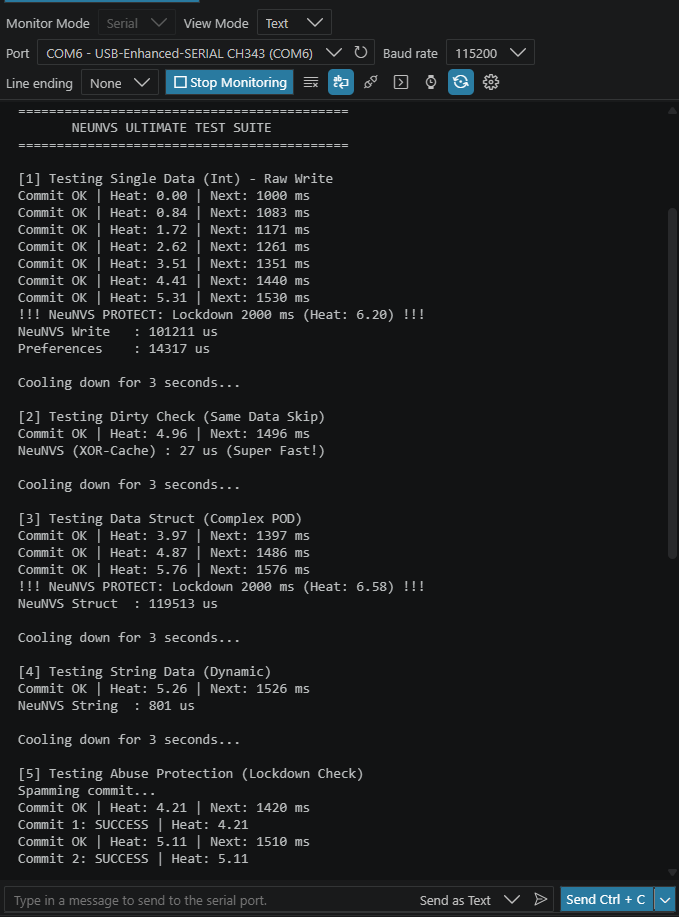
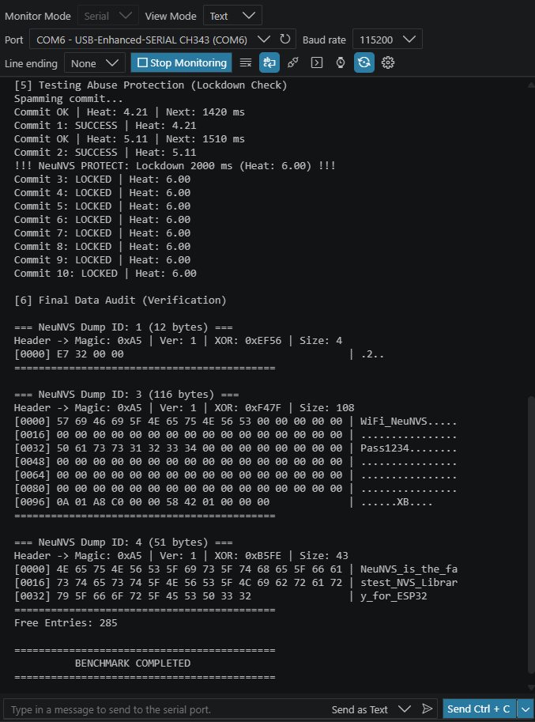

# NeuNVS

**High-Performance & Hardware-Protected NVS Library for ESP32**

The Smartest, Fastest, and Safest Hardware-Protected Storage for the ESP32.
NeuNVS is a next-generation storage library for the ESP32 designed as a high-performance alternative to `Preferences` and `EEPROM`.

This library not only stores data but also actively protects your hardware using an intelligent Virtual Heat Meter algorithm that works like a CPU's thermal protection system to maintain the longevity of your Flash memory.

[](https://opensource.org/licenses/MIT)
[](https://espressif.com)
[](https://arduino.cc)
[](https://isocpp.org/)

---

## Why NeuNVS?

Standard libraries often neglect hardware health and data integrity.

**NeuNVS** is designed to fill this gap with four core pillars:

- **Ultra-Fast ID System** Uses a numeric ID (0-255) instead of a String Key, enabling near-instant memory access by eliminating string-parsing overhead.

- **Smart Thermal Throttling** An exclusive "Heat Meter" feature. The library monitors the intensity of data writes and automatically locks down if it detects activity that could jeopardize Flash lifespan (such as a loop bug)

- **Data Integrity** Every data block is secured with a Magic Byte and XOR Checksum. Say goodbye to corrupted data and silent failures!

- **Hybrid Memory Management** Minimizes RAM fragmentation using an intelligent allocation strategy (Stack/Heap Hybrid), ensuring stability even in long-running projects.

---

## Benchmark Results

Tested on **ESP32-D0WDQ6** (v1.0.1).
Results show that NeuNVS significantly outperforms standard libraries.

| Feature                      | NeuNVS (Ours)           | Standard Preferences | Improvement        |
| :--------------------------- | :---------------------- | :------------------- | :----------------- |
| **Dirty Check Skip**         | **28 µs**               | 18,435 µs            | **650x Faster!**   |
| **Complex Struct (100 ops)** | **24.9 ms**             | 980.2 ms             | **39.3x Faster!**  |
| **Safety System**            | **Adaptive Throttling** | None (Burn Out Risk) | **Hardware Safe**  |
| **RAM Usage**                | **Hybrid Stack**        | Heap Allocation      | **Minimized Frag** |

> **Note:** "Dirty Check Skip" refers to the time taken to verify that data hasn't changed, preventing unnecessary Flash writes and extending hardware lifespan.

<p align="center">
  
  <br>
  
  <br>
  <em>Real-world benchmark logs captured from Serial Monitor (ESP32-D0WDQ6)</em>
</p>

---

## Key Features

- **XOR Data Integrity:** Every data block (including Strings!) is protected with ultra-lightweight XOR checksum and size validation. No more corrupt data!

- **Hardware Lockdown:** Exclusive "Abuse Protection" that automatically locks Flash writes if a loop-bug or frequent commits are detected (configurable threshold).

- **Smart Dirty Check:** Internal comparison prevents unnecessary Flash writes, extending your hardware's lifespan significantly.

- **Auto-Namespace:** Seamlessly handle multiple instances with automatic namespace allocation (`ns0`, `ns1`, ...).

- **Ultra-Lightweight:** Minimal stack usage, no dynamic memory allocation for POD types.

- **Full String Support:** String data is also protected with XOR checksum (unlike many alternatives).

---

## Installation

### Arduino IDE

1. Download this repository as a `.zip`
2. Go to **Sketch** → **Include Library** → **Add .ZIP Library**
3. Select the downloaded file

### PlatformIO

```ini
lib_deps =
    https://github.com/ulywae/NeuNVS.git
```

---

## Quick Start

### Basic Usage

```cpp
#include <NeuNVS.h>

// 1. Define your data structure (Must be POD/Plain Old Data)
struct UserSettings {
    float targetTemp;
    bool alarmEnabled;
    uint16_t sensorId;
};

void setup() {
    Serial.begin(115200);

    // Initialize with 1s auto-commit interval, 5s lockdown duration, max 5 commits
    if (!neuNVS.begin(1000, 5, 5)) {
        Serial.println("Failed to initialize NeuNVS!");
        return;
    }

    // --- Basic Types ---
    uint32_t myData = 1337;
    neuNVS.put(1, myData); // Write ID 1

    uint32_t savedData;
    if (neuNVS.get(1, savedData)) {
        Serial.printf("Saved Data: %u\n", savedData);
    }

    // --- Complex Structs ---
    UserSettings mySettings = {24.5, true, 404};
    neuNVS.put(2, mySettings); // Write ID 2

    UserSettings loadedSettings;
    if (neuNVS.get(2, loadedSettings)) {
        Serial.printf("Temp: %.1f, Alarm: %s\n",
                      loadedSettings.targetTemp,
                      loadedSettings.alarmEnabled ? "ON" : "OFF");
    }

    // --- Strings with XOR protection ---
    neuNVS.putString(10, "Hello NeuNVS!");
    String str = neuNVS.getString(10);
    Serial.println(str);
}

void loop() {
    // MUST be called to process auto-commits and monitor hardware safety
    neuNVS.update();
}
```

---

## Advanced Features

### Error Callbacks

Get notified when hardware issues or data corruption occurs:

```cpp
void onStorageError(uint8_t code, uint8_t id) {
    switch(code) {
        case NeuNVS::ERR_LOCKDOWN:
            Serial.println("Hardware Protected: Too many writes!");
            break;
        case NeuNVS::ERR_DATA_CORRUPT:
            Serial.printf("Data corrupted at ID: %d\n", id);
            break;
        case NeuNVS::ERR_SIZE_MISMATCH:
            Serial.printf("Size mismatch for ID: %d\n", id);
            break;
        case NeuNVS::ERR_WRITE_FAILED:
            Serial.println("Flash write failed!");
            break;
    }
}

void setup() {
    neuNVS.onError(onStorageError);
    neuNVS.begin();
}
```

### Manual Commit & Clean

```cpp
neuNVS.put(5, 100);
neuNVS.commit();   // Force immediate write

neuNVS.remove(5);  // Delete specific ID
neuNVS.clearAll(); // Factory reset entire namespace
```

### Multiple Instances

Each instance is automatically assigned a unique namespace (ns0, ns1, etc.), ensuring no data collisions between different storage objects.

```cpp
NeuNVS configStorage;
NeuNVS userStorage;

void setup() {
    configStorage.begin(1000, 5, 3);  // ns0
    userStorage.begin(2000, 10, 5);   // ns1

    configStorage.put(1, 9600);       // Baud rate config
    userStorage.putString(1, "Alice"); // Username
}
```

> [!IMPORTANT]
>
> ### ID Scope & Range
>
> - **ID Range:** You can use IDs from **0 to 255**.
> - **Isolated Scope:** This ID range is **local per-instance**.
> - **Example:** You can store data under `ID 1` in `configStorage` and different data under `ID 1` in `userStorage`. They won't overwrite each other because they're automatically stored in different namespaces (`ns0`, `ns1`, etc.).

### Check Lockdown Status

```cpp
if (neuNVS.isLocked()) {
    Serial.println("System is locked! Waiting for cooldown...");
} else {
    neuNVS.put(99, 123);
}
```

---

### Error Codes

| Code | Name                   | Description                                        |
| :--- | :--------------------- | :------------------------------------------------- |
| 0    | `ERR_NONE`             | Operation successful.                              |
| 1    | `ERR_LOCKDOWN`         | Abuse protection active! Too many writes detected. |
| 2    | `ERR_WRITE_FAILED`     | Flash write operation failed at NVS level.         |
| 3    | `ERR_READ_FAILED`      | Failed to read data from flash memory.             |
| 4    | `ERR_ID_NOT_FOUND`     | Requested ID doesn't exist.                        |
| 5    | `ERR_DATA_CORRUPT`     | XOR checksum mismatch (Data is corrupted!).        |
| 6    | `ERR_SIZE_MISMATCH`    | Data size doesn't match the stored value.          |
| 7    | `ERR_INSTANCE_INVALID` | Instance not valid (Max 254).                      |
| 8    | `ERR_ALLOC_FAILED`     | Out of RAM (Heap) while processing data.           |

---

## API Reference

### Initialization & Core

| Method                       | Description                                                      |
| :--------------------------- | :--------------------------------------------------------------- |
| `begin(interval, lock, max)` | Init NVS with interval (ms), lockdown (sec), and max commits.    |
| `update()`                   | **Must be called in `loop()`** to process pending auto-commits.  |
| `commit()`                   | Manually trigger a write to Flash (subject to Abuse Protection). |
| `end()`                      | Close NVS handle and cleanup.                                    |

---

### Data Operations

| Method                         | Description                                                                  |
| :----------------------------- | :--------------------------------------------------------------------------- |
| `put(id, value)`               | Store any **POD** type (int, float, struct, etc.) with automatic XOR header. |
| `get(id, outValue, default)`   | Retrieve data with XOR validation. Returns `true` if successful.             |
| `putString(id, value)`         | Store `String` object with XOR protection.                                   |
| `getString(id, &out, default)` | Retrieve `String` with XOR validation and default value fallback.            |
| `exists(id)`                   | Returns `true` if the specific ID exists in current namespace.               |
| `remove(id)`                   | Delete a specific ID and its associated data.                                |
| `clearAll()`                   | Wipe all data in the current namespace (Factory Reset).                      |
| `commit()`                     | Force immediate write to Flash (subject to Abuse Protection).                |

---

### Status & Debugging

| Method                  | Description                                              |
| :---------------------- | :------------------------------------------------------- |
| `isLocked()`            | Returns `true` if hardware lockdown is currently active. |
| `isValid()`             | Check if instance was created successfully (max 254).    |
| `getNamespace()`        | Returns current namespace name (e.g., `ns0`).            |
| `getTotalFreeEntries()` | Get global free NVS entries.                             |
| `dump(id)`              | Print professional **Hex + ASCII dump** for debugging.   |

---

## Technical Specifications

| Parameter                | Value / Detail                                  |
| :----------------------- | :---------------------------------------------- |
| **Namespace Management** | Automatic Rotation (`ns0` to `ns253`)           |
| **Indexing System**      | ID-based (`uint8_t`), range `0` - `255`         |
| **Internal Key Format**  | `id[ID]` (e.g., ID 255 becomes key `id255`)     |
| **Data Overhead**        | **4 Bytes** per entry (2b XOR + 2b Size Header) |
| **Instance Limit**       | Up to **254** simultaneous instances            |
| **Default Auto-Commit**  | `1000 ms` (Configurable)                        |
| **Default Lockdown**     | `5 seconds` duration after `5` rapid commits    |
| **Storage Engine**       | Native ESP-IDF NVS                              |

---

## Requirements

· ESP32 (all variants: D0WD, D0WDQ6, S3, C3, etc.)

· Arduino ESP32 core (tested with v2.0.0+)

· C++11 or later

---

## Limitations

· POD Types Only: Objects must be Trivially Copyable. Do not use classes with virtual methods or dynamic pointers inside put().

· String Size: Limited by NVS blob constraints (~4000 bytes max).

· Thread Safety: Not thread-safe for multi-tasking (use Mutex if accessing from different FreeRTOS tasks).

---

## Migration from Preferences

| Preferences                        | NeuNVS                     |
| :--------------------------------- | :------------------------- |
| preferences.putInt("key", 10)      | neuNVS.put(1, 10)          |
| preferences.getInt("key", 0)       | neuNVS.get(1, 0)           |
| preferences.putString("str", "hi") | neuNVS.putString(10, "hi") |
| preferences.getString("str", "")   | neuNVS.getString(10, "")   |
| preferences.clear()                | neuNVS.clearAll()          |

---

## License

Distributed under the MIT License. See LICENSE for more information.

---

## Author

Created by Ulywae @ Neu

---

## Contributing

Issues and pull requests are welcome! For major changes, please open an issue first to discuss.

---

### Star History

If you find this library useful, please give it a ⭐ on GitHub!

---
